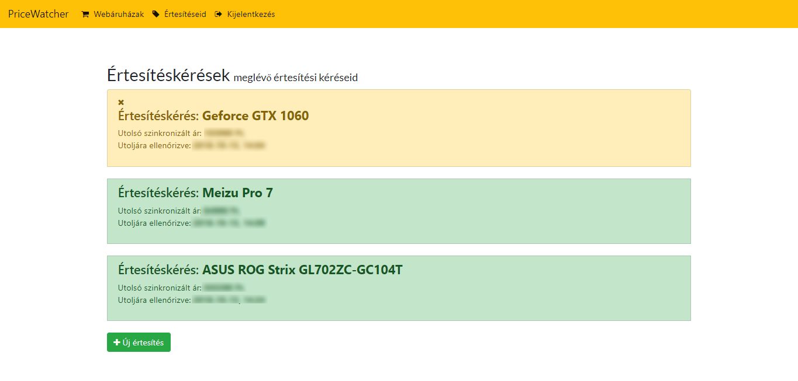
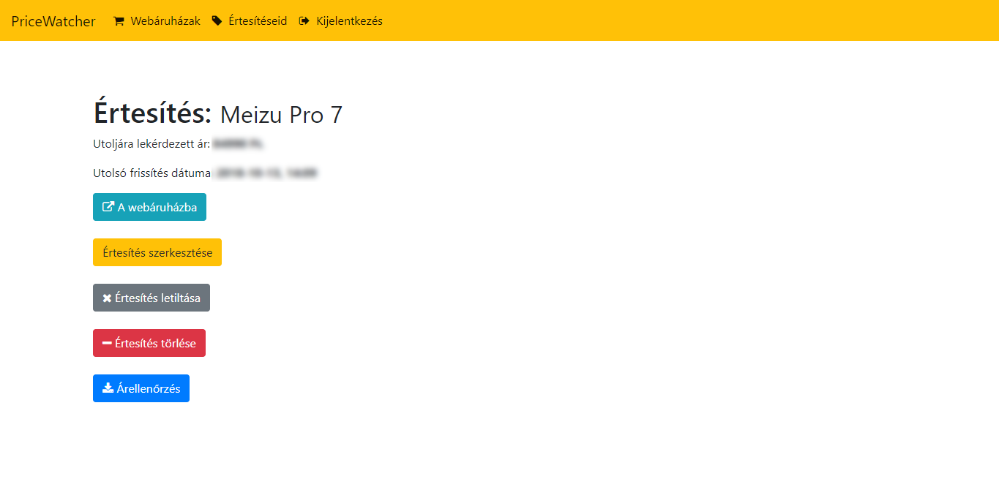
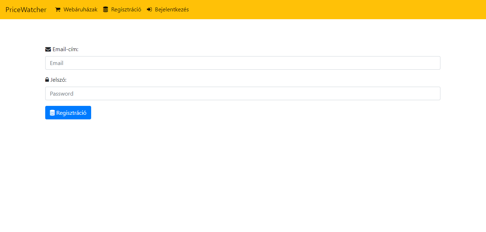
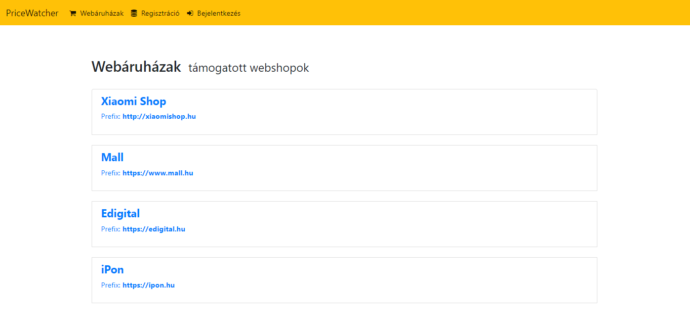

Árértesítő szolgáltatás

A webapp segítségével meghatározott online áruházak esetében adott terméknél az árak automatikus, periodikus ellenőrzésére van lehetőség, majd beállított árlimit elérése esetén értesíti a felhasználót a kedvezményes ár-ról.

Webáruházakat csak az adminisztrátor tudja hozzáadni, szerkeszteni, eltávolítani, a felhasználó a betáplált boltok termékei közül választhat (jelenleg Edigital, iPon, Mall, Xiamoishop, eMag) tetszőleges számút.

A felhasználó regisztrálás után létrehozhat értesítéseket a különböző támogaott webáruházak termékeihez, módsíthatja az értesítési ára(ka)t, letilthatja vagy törölheti az általa létrehozott értesítéseket.

Az értesítések egy e-mail API segítségével kerülnek elküldésre a felhasználó regisztrációkor megadott mail címére.

A webapplikáció különböző technológiák együttesével képes ellátni feladatát: MongoDB mint adatbázis (NoSQL), Python (alap programozási nyelv), Flask (mikro web-szerver), jinja2 (sablonmotor Pythonhoz), Mailgun (sandbox verzió, e-mail-ek küldéséhez, max. 5 recipiens).

